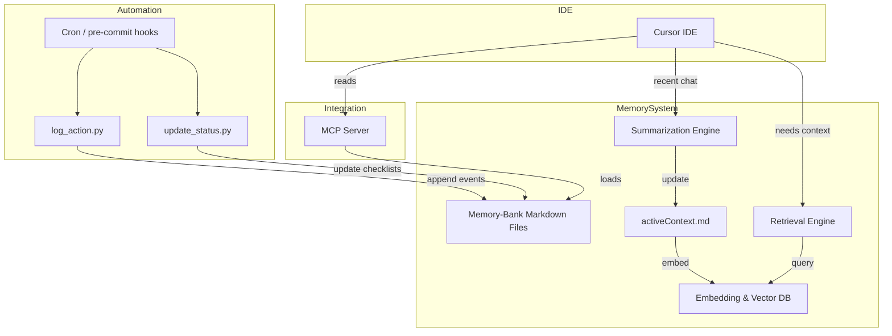

# System Architecture – Cursor Memory Project

> **Scope**: Defines the technical architecture for implementing continuous context engineering in this repository.

---

## 1. High-Level Component Diagram



### Legend
* **Cursor IDE**: User-facing chat + tool calls.  
* **MCP Server**: Serves Memory-Bank files as structured context on session start.  
* **Memory-Bank**: Persistent long-term docs (`memory-bank/`).  
* **activeContext.md**: Mid-term rolling summary.  
* **Summarization Engine**: Condenses recent chat into active context.  
* **Embedding & Vector DB**: FAISS or SQLite-vector store holding embeddings of memory chunks.  
* **Retrieval Engine**: Fetches top-K relevant chunks for each request.  
* **Automation Scripts**: Keep logs, status, and memory synchronized.

---

## 2. Data Flow

1. **Startup**  
   a. MCP server loads all files in `memory-bank/` and exposes them via HTTP.  
   b. `.cursor-rules.md` directs Cursor to read the MCP endpoint before first user prompt.
2. **Conversation**  
   a. Cursor appends each user/assistant turn to a local rolling buffer.  
   b. After *N* turns or token budget trigger, `summarize_chat.py` is invoked:  
      • Generates abstractive summary.  
      • Writes/overwrites `memory-bank/activeContext.md`.  
      • Embeds summary paragraphs into vector store.
3. **Context Retrieval**  
   a. On each new user prompt, `retrieve_context.py` embeds the prompt text and performs similarity search.  
   b. Top-K chunks (max 5) are concatenated to the prompt sent to the LLM.  
4. **Logging & Status**  
   • `log_action.py` records major events (errors, summaries, retrieval stats).  
   • `update_status.py` refreshes checklists/roadmap.
5. **Backup & Archiving**  
   • `backup_data.sh` archives `memory-bank/`, `logs/`, and `status/` nightly to `backups/`.

---

## 3. Directory Structure (Memory-Bank)

```text
memory-bank/
  ├── projectbrief.md         # Why the project exists
  ├── productContext.md       # User goals & pain points
  ├── activeContext.md        # Rolling summary (auto-generated)
  ├── systemPatterns.md       # Architecture & design patterns
  ├── techContext.md          # Tech stack & constraints
  └── progress.md             # Current status, blockers
```

---

## 4. Technology Choices

| Layer | Candidate | Rationale |
|-------|-----------|-----------|
| Summarization | OpenAI GPT-4o or local LLM | High quality, context-aware summaries |
| Embeddings | `text-embedding-3-small` | Lightweight & cost-efficient |
| Vector Store | FAISS (Python) | Simple, offline, no server overhead |
| MCP Server | `modelcontextprotocol/servers` (Python) | Reference implementation, easy to extend |
| Scheduling | Unix `cron` or `pre-commit` git hooks | Minimal dependencies |

---

## 5. Security & Compliance

* **Data residency**: All memory stored locally within repo; backups encrypted if remote.
* **Access control**: Contributors must run `scripts/log_action.py` for audit trail (see `SECURITY.md`).
* **No secrets** in Memory-Bank; redacted if necessary.

---

## 6. Open Questions / Next Design Tasks

1. Decide exact summarization cadence (*N* turns vs token threshold).  
2. Choose embedding dimension & similarity metric.  
3. Evaluate persistence strategy for FAISS index (commit vs regenerate).  
4. Confirm MCP authentication needs (if any).

---

## 7. Security Considerations

* MCP server binds to `localhost` by default; restrict firewall for remote deployments.
* Backups are stored locally and uploaded to GitHub artifacts (7-day retention).
* Pre-commit hook and CI prevent committing secrets.
* Only `cursor` service account runs production process with minimal permissions.

---

*Last updated: <!--date-->* 