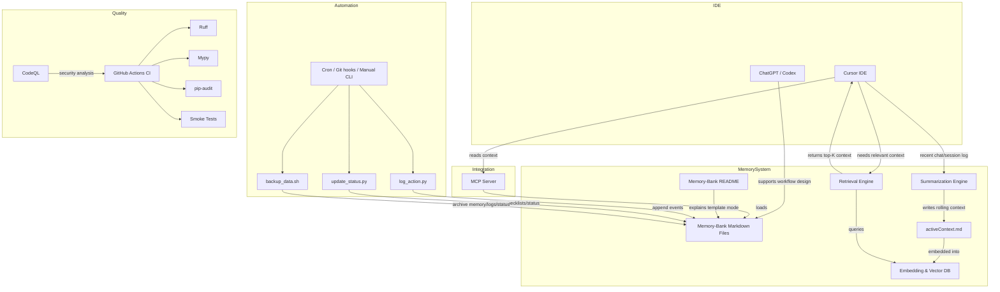

# System Architecture – Cursor Memory Project

> **Scope:** Defines the technical architecture for implementing continuous context engineering, persistent project memory, retrieval, MCP-oriented context delivery, automation, local-first backend evolution, and QA practices in this repository.

---

## 1. Purpose

The Cursor Memory Project is a local-first AI-assisted development framework designed to help long-running projects preserve context across sessions.

The system gives Cursor, ChatGPT, Codex, and human collaborators a structured way to maintain:

- persistent project memory
- template-based project context initialization
- rolling active context
- retrieval-based context loading
- repeatable summarization workflows
- audit-friendly logs and status tracking
- local automation scripts
- public CI, type checking, linting, dependency checks, and security checks

The project is not intended to be a complete production SaaS platform. It is a public technical artifact showing how AI-assisted development infrastructure can be structured, documented, tested, and evolved toward larger LLM and agent-based systems.

---

## 2. Template Mode vs Active Project Mode

This repository operates in two main modes.

### 2.1 Template Mode

Template Mode is the initial state of the repository.

In this mode:

- `memory-bank/` starts mostly empty by design
- memory files act as structured placeholders
- no fake project knowledge should be added
- `memory-bank/README.md` explains how future project memory should be populated
- the repository functions as a reusable setup system for Cursor-based AI-assisted development

Template Mode prevents fake context, outdated assumptions, or hallucinated project details from contaminating future work.

### 2.2 Active Project Mode

Active Project Mode begins after a real project kickoff.

In this mode:

- `projectbrief.md` is filled with real project vision, goals, non-goals, and stakeholders
- `productContext.md` is updated after real user/persona discovery
- `activeContext.md` is updated through summarization workflows
- `systemPatterns.md` records architecture decisions and patterns
- `techContext.md` tracks the real technology stack and constraints
- `progress.md` tracks actual status, blockers, and milestones

The system is designed so project memory grows from real work, not pre-written assumptions.

---

## 3. System Boundaries

### In Scope

This repository covers:

- local project memory stored in markdown files
- memory-bank template mode for new projects
- active context summarization
- FAISS-based retrieval index generation
- MCP server structure for exposing context to Cursor
- Python automation scripts for logging, status updates, retrieval, summarization, and backups
- local-first developer workflows
- CI smoke tests, linting, type checking, dependency/security checks, and CodeQL
- Archived Docker/Nginx starter configuration preserved as reference-only deployment scaffolding
- documentation-first project governance

### Out of Scope

This public version does not include:

- multi-tenant authentication
- hosted SaaS deployment
- frontend dashboard
- enterprise observability stack
- managed production vector database
- role-based access control
- production permission model
- large-scale user/project isolation
- cloud-hosted background jobs
- full production incident-response automation

These are intentionally documented as production-evolution paths rather than represented as completed capabilities.

---

## 4. High-Level Component Diagram


```mermaid
graph TD
    subgraph IDE
        C[Cursor IDE]
        CG[ChatGPT / Codex]
    end

    subgraph MemorySystem
        MB[Memory-Bank Markdown Files]
        MBR[Memory-Bank README]
        AC[activeContext.md]
        Embed[Embedding & Vector DB]
        Sum[Summarization Engine]
        Ret[Retrieval Engine]
    end

    subgraph Automation
        Log[log_action.py]
        Stat[update_status.py]
        Backup[backup_data.sh]
        Sched[Cron / Git hooks / Manual CLI]
    end

    subgraph Integration
        MCP[MCP Server]
    end

    subgraph Quality
        CI[GitHub Actions CI]
        Ruff[Ruff]
        Mypy[Mypy]
        Audit[pip-audit]
        CodeQL[CodeQL]
        Tests[Smoke Tests]
    end

    C -->|reads context| MCP
    CG -->|supports workflow design| MB
    MCP -->|loads| MB
    MBR -->|explains template mode| MB

    C -->|recent chat/session log| Sum
    Sum -->|writes rolling context| AC
    AC -->|embedded into| Embed

    C -->|needs relevant context| Ret
    Ret -->|queries| Embed
    Ret -->|returns top-K context| C

    Log -->|append events| MB
    Stat -->|update checklists/status| MB
    Backup -->|archive memory/logs/status| MB
    Sched --> Log
    Sched --> Stat
    Sched --> Backup

    CI --> Ruff
    CI --> Mypy
    CI --> Audit
    CI --> Tests
    CodeQL -->|security analysis| CI
```

### Legend

- **Cursor IDE:** Primary AI-assisted development environment.
- **ChatGPT / Codex:** Supporting tools for reasoning, planning, code review, and workflow design.
- **MCP Server:** Local server pattern that exposes memory-bank content as structured context.
- **Memory-Bank:** Persistent markdown-based project memory.
- **Memory-Bank README:** Explains why memory starts as a template and how it should be populated.
- **activeContext.md:** Rolling summary of recent context and decisions.
- **Summarization Engine:** Converts recent chat or session logs into updated project memory.
- **Embedding & Vector DB:** Local FAISS-based retrieval index.
- **Retrieval Engine:** Fetches relevant memory chunks for new prompts or tasks.
- **Automation Scripts:** Maintain logs, status, backups, and project continuity.
- **CI/QA Layer:** Runs linting, type checking, dependency/security checks, smoke tests, and CodeQL.

---

## 5. Data Flow

### 5.1 Startup Flow

1. The developer opens the repository in Cursor.
2. `.cursor-rules.md` defines how Cursor should interact with project memory.
3. The developer reviews `README.md`, `PROJECT_RULES.md`, `memory-bank/README.md`, and `docs/ARCHITECTURE.md`.
4. The MCP server can be started locally.
5. The MCP server reads memory-bank files and exposes structured context.
6. Cursor can retrieve project context before the first major interaction.

### 5.2 Template Initialization Flow

1. A new project starts with mostly empty memory-bank files.
2. `memory-bank/README.md` explains the purpose of each file.
3. Real memory is added only after kickoff, discovery, implementation, errors, decisions, or milestones.
4. This avoids fake context being treated as project truth.

### 5.3 Summarization Flow

1. A session log or chat history is provided to `scripts/summarize_chat.py`.
2. If `OPENAI_API_KEY` is available, the script can use OpenAI for summarization.
3. If no API key is available, the script falls back to manual or zero-cost summarization modes.
4. The generated summary is written to `memory-bank/activeContext.md`.
5. The summary can be embedded and added to the retrieval index.

### 5.4 Retrieval Flow

1. A new user prompt or task requires context.
2. `scripts/retrieve_context.py` embeds the query text.
3. The FAISS index is searched for relevant memory chunks.
4. Top-K chunks are returned as context.
5. The developer or AI assistant uses the retrieved context to continue work with less information loss.

### 5.5 Logging and Status Flow

1. `scripts/log_action.py` records major events, implementation notes, and errors.
2. `scripts/update_status.py` refreshes checklists, status files, and roadmap-style documentation.
3. Logs and status updates help maintain continuity across sessions.

### 5.6 Backup Flow

1. `scripts/backup_data.sh` archives memory, logs, and status directories.
2. Encrypted backup flows require `GPG_KEY_ID` or configured secret paths.
3. Because GPG configuration is environment-specific, backup integration tests are separated from public CI smoke tests.

---

## 6. Runtime Modes

### 6.1 Template Mode

Used before a real project begins.

Capabilities:

- provide structured memory-bank placeholders
- document how memory should be populated
- preserve project setup rules
- prevent fake project knowledge from entering memory
- support repeatable Cursor/Codex/ChatGPT project setup

### 6.2 Local Development Mode

Used when a developer runs the system locally with optional API keys.

Capabilities:

- summarize logs
- build retrieval index
- start MCP server
- query memory
- run local tests
- run manual backups if GPG is configured

### 6.3 Zero-Cost / Manual Mode

Used when no OpenAI API key is available.

Capabilities:

- fallback summarization
- manual context updates
- local memory-bank usage
- documentation and logging workflows
- smoke testing without external API dependencies

### 6.4 Public CI Mode

Used by GitHub Actions for public repository validation.

Capabilities:

- linting with `ruff`
- type checking with `mypy`
- dependency/security checks with `pip-audit`
- focused smoke tests
- CodeQL security checks

Public CI intentionally avoids secret-dependent backup and E2E flows.

### 6.5 Configured Integration Mode

Used when required secrets and environment variables are configured.

Capabilities:

- encrypted backup tests
- full E2E backup/restore workflows
- external API-backed summarization
- deeper integration testing

---

## 7. Directory Structure

```text
cursor-memory-project/
  ├── .github/                       # CI, CodeQL, Dependabot, workflows
  ├── cursor_setup_instructions/     # Canonical setup guide
  ├── diary/                         # Project diary and development log
  ├── docs/                          # Architecture, security, deployment docs
  ├── logs/solutions/                # Error logs and implementation notes
  ├── memory-bank/                   # Starter project memory template
  ├── nginx/                         # Starter reverse-proxy configuration
  ├── scripts/                       # Automation, retrieval, summarization, backup scripts
  ├── status/                        # Roadmap, checklists, project status
  ├── tests/                         # Unit, smoke, and validation tests
  ├── archive/deprecated-deployment/Dockerfile          # Archived container setup reference
  ├── archive/deprecated-deployment/docker-compose.yml  # Archived local orchestration reference
  ├── env.template                   # Safe environment template
  ├── Makefile                       # Developer commands
  ├── PROJECT_RULES.md               # Operating rules
  └── README.md                      # Public project overview
```

---

## 8. Memory-Bank Structure

```text
memory-bank/
  ├── README.md              # Explains template mode and memory usage
  ├── projectbrief.md        # Project vision, goals, non-goals, stakeholders
  ├── productContext.md      # User goals, pain points, personas, motivations
  ├── activeContext.md       # Rolling summary, generated or updated
  ├── systemPatterns.md      # Architecture and design patterns
  ├── techContext.md         # Tech stack and constraints
  └── progress.md            # Current status, blockers, and next steps
```

The memory-bank is intentionally markdown-based to keep the system:

- inspectable
- portable
- versionable
- easy for humans and AI tools to read
- compatible with Git-based workflows

In Template Mode, these files may be mostly empty. In Active Project Mode, they should contain real project knowledge derived from actual work.

---

## 9. Technology Choices

| Layer | Current Choice | Rationale |
|---|---|---|
| AI-assisted IDE | Cursor | Native AI coding workflow and project context support |
| AI support tools | ChatGPT / Codex | Planning, reasoning, review, and AI-assisted implementation support |
| Memory format | Markdown | Human-readable, versionable, easy to parse |
| Summarization | OpenAI or fallback/manual mode | Supports both automated and zero-cost workflows |
| Embeddings | OpenAI embedding model when configured | Lightweight retrieval workflow |
| Vector store | FAISS | Local-first, fast, no external server required |
| MCP/context exposure | Local MCP server structure | Allows memory to be exposed to AI coding environment |
| Automation | Python and shell scripts | Simple, inspectable, portable |
| CI | GitHub Actions | Public validation of repo health |
| Linting | Ruff | Fast Python linting |
| Type checking | Mypy | Static type confidence |
| Dependency/security checks | pip-audit | Dependency vulnerability detection |
| Security analysis | CodeQL | GitHub-native code scanning |
| Archived container scaffolding | Docker / docker-compose | Preserved under archive/deprecated-deployment/ as reference material, not part of the active local-first workflow surface |
| Archived reverse proxy scaffold | Nginx starter config | Preserved under archive/deprecated-deployment/ for future review before any hosted or single-VM usage |
| Environment template | env.template | Safe local setup template without committed secrets |

---

## 10. Testing Strategy

### 10.1 Local Test Suite

Developers can run:

```bash
pytest -q
```

This may include tests that depend on local configuration, such as encrypted backup behavior.

### 10.2 Public CI Smoke Tests

The public CI workflow validates the repository without requiring private secrets.

It runs:

- `ruff check .`
- `mypy scripts tests`
- `pip-audit --strict`
- focused smoke tests

This keeps the public workflow useful, reviewable, and green without pretending that secret-dependent integration flows can run in an unconfigured environment.

### 10.3 Integration Tests

Backup and end-to-end tests require environment-specific configuration, including:

- `GPG_KEY_ID`
- backup directories
- local encryption setup
- optional external API keys

These should run in a configured integration environment, not in the public smoke-test workflow.

---

## 11. Failure Modes and Recovery

| Failure Mode | Cause | Recovery |
|---|---|---|
| Missing `OPENAI_API_KEY` | API key not configured | Use fallback/manual summarization mode |
| Empty FAISS index | Retrieval index not built | Run `python scripts/retrieve_context.py rebuild` |
| Missing `GPG_KEY_ID` | Encrypted backup key not configured | Configure key or skip backup integration tests |
| Stale memory context | activeContext not updated | Re-run summarization workflow |
| Fake project context | Memory-bank filled before real project kickoff | Restore template state and populate only from real work |
| CI import error | Python path/package issue | Ensure package imports and `PYTHONPATH` are configured |
| Type mismatch in FAISS helpers | FAISS returns generic index type | Use broader `faiss.Index` annotation |
| Failed dependency audit | Vulnerable dependency | Upgrade, constrain, or pin dependency while preserving security checks |
| MCP server unavailable | Server not running | Start `python scripts/run_mcp_server.py` |
| External API unavailable | Network/API/service issue | Use fallback/manual mode |
| Invalid Docker Compose structure | YAML indentation or service placement issue | Validate compose file and keep services under `services:` |
| Reverse proxy overclaim | Starter Nginx config treated as hardened production gateway | Document as starter config and harden before external deployment |

---

## 12. Security and Reliability Considerations

### Secrets

- Secrets should not be committed to the repository.
- API keys are loaded through environment variables or file-based secret paths.
- `env.template` is safe to commit because it contains no real secrets.
- Backup encryption uses `GPG_KEY_ID` or `GPG_KEY_ID_FILE`.

### Memory-Bank Safety

The memory-bank should not store:

- API keys
- passwords
- credentials
- personal data
- protected health information
- client-confidential information
- secrets or tokens
- proprietary data without authorization

### Localhost Binding

The MCP server is intended primarily for local development. Remote exposure requires additional authentication, firewall, and access-control review.

### Nginx

The Nginx configuration is a starter local/single-VM reverse proxy example. Production deployments should add managed TLS, stronger authentication, rate limiting, structured access logs, monitoring, and environment-specific firewall controls.

### Backups

Backup workflows should be encrypted when sensitive project memory is included. Public CI does not execute secret-dependent backup flows.

### Public CI

The public workflow is intentionally limited to checks that do not require secrets. This prevents leaking sensitive configuration while still showing repository quality.

### Dependency and Code Scanning

The repository uses:

- `pip-audit` for dependency checks
- CodeQL for code scanning
- branch protection for safer repository maintenance
- focused smoke tests for public workflow validation

---

## 13. Architecture Tradeoffs

### Markdown Memory vs Database

**Decision:** Use markdown files for the public/local-first version.

**Why:** Markdown is inspectable, easy to version, AI-readable, and simple to maintain.

**Tradeoff:** It is not ideal for multi-tenant production systems, complex permissions, or high-volume writes.

### Template Memory vs Pre-Filled Memory

**Decision:** Keep memory-bank files mostly empty until real project work begins.

**Why:** Pre-filling memory with fake project knowledge risks contaminating future AI-assisted work.

**Tradeoff:** Reviewers must understand that the repository demonstrates a setup system, not an already-populated client memory base.

### FAISS vs Managed Vector Database

**Decision:** Use FAISS locally.

**Why:** FAISS is simple, fast, offline, and does not require external infrastructure.

**Tradeoff:** Production systems may require Qdrant, Pinecone, PgVector, or another managed retrieval layer.

### Public Smoke Tests vs Full Integration Tests

**Decision:** Public CI runs smoke tests, while secret-dependent backup/E2E tests are reserved for configured environments.

**Why:** Public CI cannot safely run encrypted backup tests without secrets.

**Tradeoff:** Full integration validation requires a separate configured workflow.

### Local MCP Structure vs Hosted Agent Service

**Decision:** Use local MCP server structure.

**Why:** It is appropriate for Cursor-based AI-assisted development and local project memory.

**Tradeoff:** A hosted agent memory service would require authentication, authorization, observability, scaling, and user isolation.

### Scripts First vs Backend Package First

**Decision:** Start with scripts and evolve toward a structured backend package.

**Why:** Scripts are inspectable and useful for local-first workflows.

**Tradeoff:** A stronger senior backend showcase requires a future `app/` package with typed routes, services, models, configuration, and tests.

---

## 14. Production and Backend Evolution Path

A production-grade or senior-backend-oriented version of this architecture could evolve into:

1. **Structured Backend API Layer**
   - `app/main.py`
   - route modules for health, memory, retrieval, summaries, and metrics
   - typed request/response models
   - service layer for memory, retrieval, and summarization

2. **Configuration Layer**
   - centralized settings
   - environment-based runtime modes
   - local vs Docker/Nginx mode
   - configurable host/CORS settings

3. **Managed Retrieval Layer**
   - Qdrant, Pinecone, PgVector, or managed FAISS service
   - chunk metadata
   - retrieval evaluation
   - hybrid search

4. **User and Project Isolation**
   - tenant-aware memory
   - permissioned context access
   - workspace-level boundaries

5. **Observability**
   - structured logs
   - tracing
   - latency metrics
   - retrieval quality metrics
   - agent/tool-call monitoring

6. **Job Scheduling**
   - scheduled summarization
   - background indexing
   - backup/restore automation
   - data retention policies

7. **Security Hardening**
   - auth layer
   - secrets manager
   - access control
   - encrypted storage
   - audit logs

8. **Frontend / Review Dashboard**
   - inspect memory-bank files
   - review retrieved chunks
   - approve summaries
   - audit context changes
   - monitor system health

---

## 15. Non-Goals

This repository does not claim to be:

- a complete enterprise agent platform
- a hosted production SaaS
- a multi-user permissioned knowledge system
- a replacement for managed vector databases
- a replacement for formal production observability
- a fully autonomous agent system
- a populated client memory base

Its purpose is to demonstrate how AI-assisted development workflows can be structured with persistent memory, retrieval, MCP-oriented context delivery, automation, documentation, and quality practices.

---

## 16. Open Questions / Next Design Tasks

1. Define exact summarization cadence: fixed number of turns, token threshold, or event-based trigger.
2. Add retrieval evaluation tests.
3. Decide whether FAISS index should be committed, generated on demand, or stored externally.
4. Define metadata schema for chunks.
5. Add a configured integration workflow for encrypted backups.
6. Improve encrypted backup restore validation.
7. Add local observability examples.
8. Add structured backend API proof of concept.
9. Add workspace/project-level isolation strategy.
10. Define memory retention and pruning policy.
11. Add documentation for MCP server extension points.
12. Add backend design documentation.

---

## 17. Reviewer Summary

This architecture demonstrates a local-first, AI-assisted development memory system with:

- template-based project memory initialization
- persistent context
- retrieval-based memory access
- MCP-oriented context delivery
- summarization and fallback modes
- Python automation
- documentation-first project governance
- CI, type checking, linting, dependency auditing, and CodeQL
- clear separation between public smoke tests and configured integration tests
- documented backend and production evolution path

The project is intentionally scoped as a public technical artifact and reusable setup method, but the architecture shows how the same design principles can evolve into production-grade LLM and agent infrastructure.

---

*Last updated: 2026-05-27*
