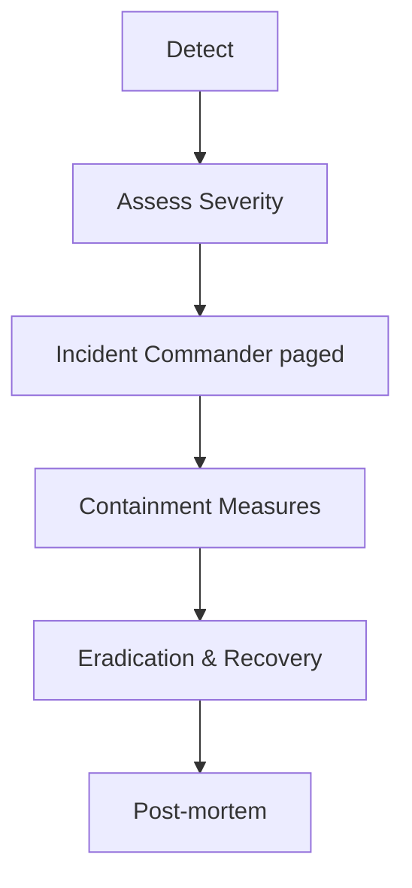

# Incident Response Plan

> This plan outlines how the team detects, communicates, contains, and resolves security incidents for the Cursor Memory Project.

## 1. Roles & Contacts
| Role | Name | Contact | Backup |
|------|------|---------|--------|
| Incident Commander | Alexandre Mourão | alex@example.com | DevOps Lead |
| Security Lead | Maria Silva | maria@example.com | QA Lead |
| DevOps Lead | João Pereira | joao@example.com | — |
| QA Lead | Ana Costa | ana@example.com | — |

## 2. Severity Levels & SLAs
| Severity | Definition | First Response | Containment | Full Resolution |
|----------|------------|---------------|------------|-----------------|
| Sev-1 | Data breach or production outage | 15 min | 1 h | 24 h |
| Sev-2 | Backup failure, health-check red | 30 min | 4 h | 48 h |
| Sev-3 | Non-critical bug or security finding | 1 h | 24 h | 7 days |

## 3. Detection & Reporting
1. Automated alerts (GitHub Actions, Slack) trigger Sev-2 ticket automatically.
2. Team members report suspected incidents via `scripts/log_action.py --type error` and Slack #incidents.

## 4. Response Workflow

## 5. Containment Examples
* Revoke leaked keys, rotate `OPENAI_API_KEY` / `GPG_KEY_ID`.
* Disable public endpoints via firewall until patch deployed.

## 6. Communication
* Internal updates every 30 minutes on Slack thread.
* External stakeholder (client) notification within 24 h for Sev-1 (GDPR Art. 33, LGPD Art. 48).

## 7. Post-Mortem
* Conduct within 5 business days.
* Follow 5-Whys template; include timeline, root cause, action items.
* Publish in `logs/solutions/` and link in `project_log.md`.

## 8. Plan Review
* Review annually or after any Sev-1 incident.

---

Linked from `docs/SECURITY.md`. 